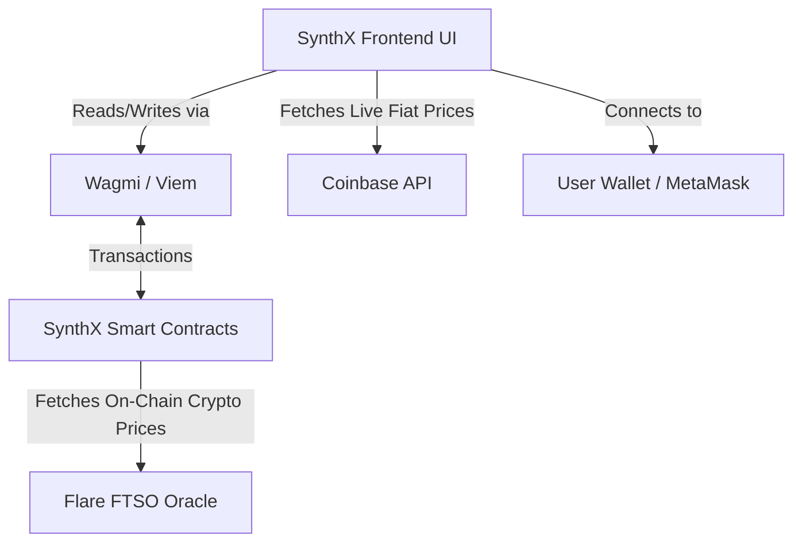
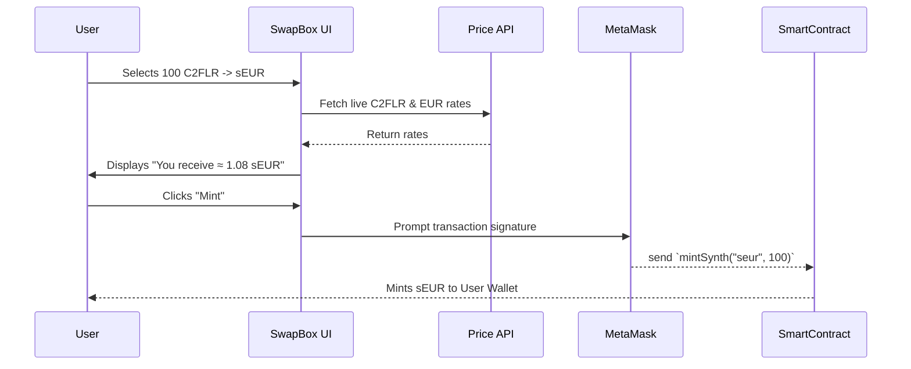
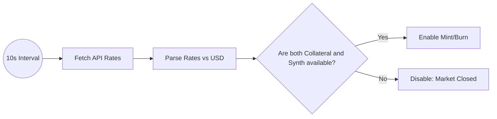

# SynthX Internal Workings & Architecture

This document breaks down the operational mechanics of SynthX. It explains how each primary function of the website works and provides visual flowcharts of the architecture.

---

## 1. High-Level System Architecture

SynthX operates as a frontend interface that communicates with the **Flare Testnet Coston2** blockchain while fetching real-time data from external oracles and web APIs.

---

## 2. Core Functionalities

### A. Minting Synthetic Assets (The "Swap / Mint" Flow)
Users can lock up supported crypto collateral (e.g., **C2FLR**, **USDT0**, **FXRP**) to mint a synthetic asset (e.g., **sEUR**, **sXAU**) that tracks real-world prices.

**How it works in the UI (`SwapBox.tsx`):**
1. **Asset Selection**: The user selects a collateral token (Pay Token) and a synthetic asset (Receive Token).
2. **Price Calculation**: The app queries the live price of both assets (using the Coinbase API for USD rates) and calculates the exchange rate. 
3. **Market Check**: If the live price for either asset is unavailable, the UI automatically disables the Mint button, displaying **"Market Closed"** to prevent minting on stale data.
4. **Smart Contract Execution**: The frontend passes the target synthetic ID and the collateral amount via Wagmi's `useWriteContract` to the `mintSynth()` function on the blockchain.

### B. Burning Synthetic Assets (Unlocking Collateral)
Users can return their Synths to the protocol to retrieve their underlying crypto collateral.

**How it works:**
1. The user clicks the swap arrow in the `SwapBox`, changing the mode to **Burn**.
2. The UI checks the contract's total liquidity (`getLiquidity`) against the required liquidity (`getRequiredLiquidity`).
3. If the contract is underfunded, it flags an insufficient liquidity warning, prompting liquidity provision.
4. If healthy, the user signs a transaction calling `burnSynth()`, destroying the Synth and returning the collateral based on the exact real-time exchange rate.

### C. Live Price Oracles & Market Restrictions
SynthX uses a highly reactive pricing model to ensure the protocol stays solvent.

- **Frontend Polling**: Inside `SwapBox.tsx`, a `useEffect` hook polls the Coinbase Exchange Rates API (`https://api.coinbase.com/v2/exchange-rates?currency=USD`) every 10 seconds.
- **Dynamic Valuation**: The `livePrices` state maps assets like `EUR`, `GBP`, `XAU` (Gold), `XRP`, and `FLR` to their USD counterparts.
- **Safety Fallbacks**: If the API fails or a market closes (e.g., weekend Forex closure), the `effectiveReceivePrice` or `effectivePayPrice` fails to resolve, triggering the `isMarketClosed` boolean to lock trading.

### D. Dynamic Charting (`PriceChart.tsx`)
The price chart provides analytical visuals for the synthetic assets.

- **Data Generation**: Because historical FTSO data can be complex to pull on the fly for testnets, the UI uses `generateMockData()` to create realistic price fluctuations (using a random walk algorithm) originating from the live price point.
- **Visualization Options**: Users can toggle between a continuous **Line Chart** and a **Candlestick Chart**.
- **Fullscreen Mode**: Users can click the expand icon to toggle an `isFullscreen` state, scaling the chart dynamically for easier deep analysis.

---

## 3. Key React Components

| Component | Responsibility |
| :--- | :--- |
| **`SwapBox.tsx`** | The central nervous system of the app. Handles the Mint/Burn logic, price API polling, slippage calculations, and direct contract interactions via Wagmi. |
| **`Navbar.tsx`** | Handles routing and wallet state. Displays a minimalist network badge ("Coston2") and wallet connect button without cluttering the UI. |
| **`AssetModal.tsx`** | The popup interface for selecting tokens. Contains a search bar, categorization tabs (Forex, Commodities), and dynamically renders either crypto collateral or synthetic assets depending on the mode. |
| **`PriceChart.tsx`** | Renders the SVG-based charts using Recharts, adapting dynamically to the currently selected asset in the `Trade` view. |
| **`WalletContext.tsx`** | A global state provider wrapping Wagmi hooks, delivering clean variables like `isConnected`, `shortAddress`, and `chainName` to the rest of the application. |
